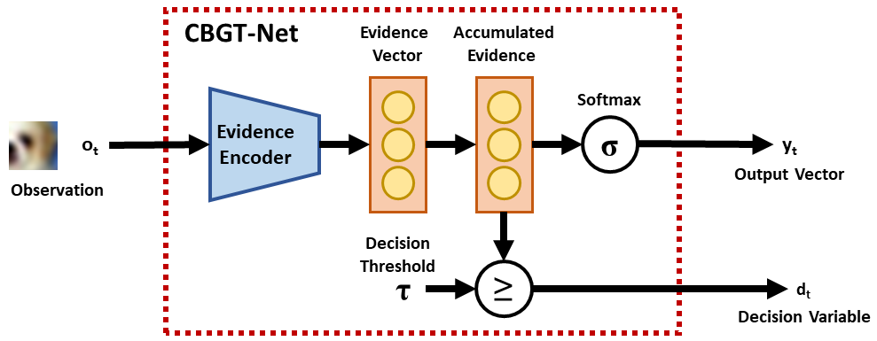

# CBGT-Net: A Neuromimetic Architecture for Robust Classification of Streaming Data

This is a Tensorflow implementation of the paper "CBGT-Net: A Neuromimetic Architecture for Robust Classification of Streaming Data"</a></b></i> published at IEEE ICHMS 2024.

## Abstract

This paper describes CBGT-Net, a neural network model inspired by the cortico-basal ganglia-thalamic (CBGT) circuits found in mammalian brains.  Unlike traditional neural network models, which either generate an output for each provided input, or an output after a fixed sequence of inputs, the CBGT-Net learns to produce an output after a sufficient criteria for evidence is achieved from a stream of observed data.  For each observation, the CBGT-Net generates a vector that explicitly represents the amount of evidence the observation provides for each potential decision, accumulates the evidence over time, and generates a decision when the accumulated evidence exceeds a pre-defined threshold.  We evaluate the proposed model on two image classification tasks, where models need to predict image categories based on a stream of small patches extracted from the image.  We show that the CBGT-Net provides improved accuracy and robustness compared to models trained to classify from a single patch, and models leveraging an LSTM layer to classify from a fixed sequence length of patches. 

## Approach



## Citation

In case you find our work useful, consider citing:
```
```

## Index

1. [Environment Setup](#setup)
2. [Dataset Preparation](#dataset-preparation)
3. [Training Models](#training)
4. [Evaluating CBGT Model](#evaluation)
5. [License](#license)

## Setup

In order to build a ```conda``` environment for running our model, run the following command:
```
conda env create -f environment.yml
```

Activate environment using:
```
conda activate py39
```

## Dataset Preparation

* Download the cifar and mnist patch dataset for this <a href="https://drive.google.com/drive/folders/1LvTeIBBy1SVSsTYUu6fL9_Ozus03Uhk-?usp=sharing">Drive Link</a>. <br>
Now add this folder to the ```cbgt_net``` folder before running any experiments on cbgt-net.

## Training

To train CBGT-Net Model, simply run the following command:

```
python -m cbgt_net.experiment --env=cifar --patch_sz=20 --threshold=2
```
The --env argument specifies which environment to use - mnist / cifar. The --patch_sz argument specifies the size of patch for each observation image. The --threshold argument specifies the value of threshold for which you want to train this CBGT-Net Model. 

To train the supervised baselines run these commands:
```
python supervised_learning_mnist.py
python supervised_learning_cifar.py
```

To train the LSTM baselines run these commands:
```
python lstm_cifar_baseline.py
python lstm_mnist_baseline.py
```

## Evaluation

To evaluate one of the trained models of our CBGT-Net, simply run the following command:
```
python evaluate_cbgt-net.py --env=cifar --patch_sz=20 --threshold=2
```

## License

Copyright (c) 2024 Shreya Sharma, Dana Hughes, Katia Sycara 

For license information, see the license.
